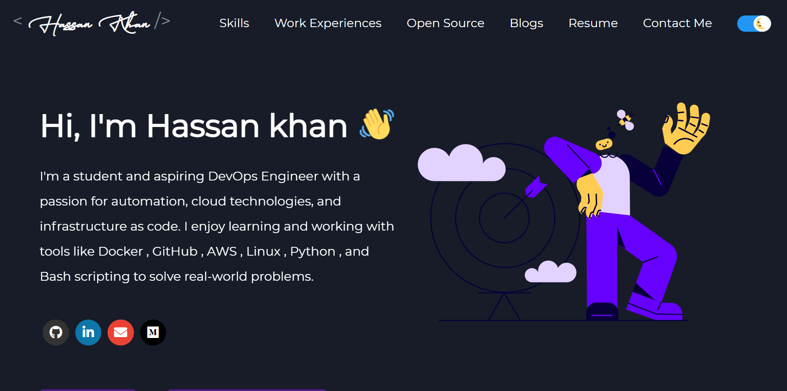

<h1 align="center">🚀 Hassan Khan's DevOps Portfolio</h1>

<p align="center">
  A modern and dynamic developer portfolio built with React.js, showcasing my journey in DevOps, cloud, and automation technologies.
</p>

<p align="center">
  <a href="https://your-live-link.com" target="_blank">
    
  </a>
  
  
  
</p>

---

## 📸 Preview

> 🌐 **Live URL**: [your-render-link](https://portfolio-atww.onrender.com)



---

## 🧠 About the Project

This portfolio website is built to showcase:

- 🌟 My skills as an aspiring DevOps engineer
- 🔨 Tools like Docker, GitHub, AWS, Linux, Python, Bash
- 📄 Medium blog posts and publications
- 🏆 Certifications and achievements
- 💼 Experience, education, and major DevOps projects

---

## 🧰 Tech Stack

| Category         | Tools & Technologies                                                  |
|------------------|------------------------------------------------------------------------|
| 🌐 Frontend       | React.js, SCSS (Sass), HTML5, CSS3                                     |
| ⚙️ DevOps         | Docker, AWS (planned integration), GitHub Actions (optional)          |
| 🌍 Deployment     | Render (live hosting), GitHub Pages (optional)                         |
| 🔗 Version Control| Git & GitHub                                                           |
| 🧪 Testing        | Jest, Enzyme                                                           |

---

## 📁 Project Structure

```
📦 portfolio/
├── public/               # Static assets & API fetched data
│   ├── profile.json
│   ├── blogs.json
│   └── resume.pdf
├── src/                  # Main codebase
│   ├── assets/           # Lottie, images
│   ├── components/       # Reusable React components
│   ├── pages/            # Page-level sections
│   └── App.js            # App entry point
├── .env                  # Environment variables
├── package.json
└── README.md
```

---

## ⚙️ Local Setup

### Prerequisites

- Node.js (v16.x recommended)
- Git

### Steps

```bash
# 1. Clone the repository
git clone https://github.com/contact-hassan-khan/portfolio.git
cd portfolio

# 2. Install dependencies
npm install

# 3. Configure environment variables
cp .env.example .env
# Edit the .env file and add your GitHub token & Medium username

# 4. Run locally
npm start
```

---

## 🔐 Environment Variables

```env
REACT_APP_GITHUB_TOKEN=your_github_token
GITHUB_USERNAME=your_github_username
MEDIUM_USERNAME=your_medium_username
USE_GITHUB_DATA=true
```

---

## 🚀 Build & Deploy

```bash
npm run build
# Upload the /build folder to your hosting platform (Render, Vercel, Netlify, GitHub Pages, etc.)
```

---

## ✨ Features

- 🧠 Dynamic GitHub profile and blog fetching
- 📄 One-click resume download
- 💬 Stylish and interactive UI
- 📱 Fully responsive
- 🌙 Dark & light themes (if enabled)

---


---

## 🙋‍♂️ Connect with Me

<p align="left">
  <a href="https://www.linkedin.com/in/contact-hassankhan" target="_blank">
    
  </a>
  <a href="https://github.com/contact-hassan-khan" target="_blank">
    
  </a>
  <a href="https://medium.com/@hassan14kha" target="_blank">
    
  </a>
</p>

---

> ⚡ Made with ❤️ by Hassan Khan — DevOps Enthusiast, Fast Learner, and Cloud Explorer.

